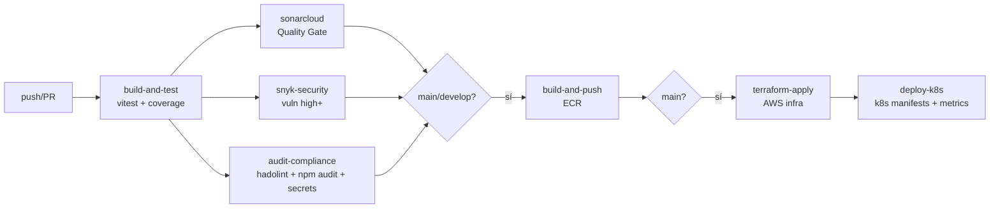

# RoTSu - Microservicio Frontend Corporativo

Este repositorio contiene la implementación del microservicio frontend para **RoTSu**, una empresa de desarrollo de software y soluciones tecnológicas orientada a Pymes y corporaciones.

El proyecto fue construido bajo estrictos estándares de ingeniería de software, enfocándose en la modularidad de componentes, un pipeline robusto de CI/CD, contenedorización optimizada, **observabilidad** y **cumplimiento normativo automatizado**.

---

## 1. Arquitectura de Software y Diseño

### Stack Tecnológico
La aplicación está desarrollada utilizando:
- **React 19** empacado con **Vite**, y gestionado a través de **pnpm** (local) / **npm** (CI/CD).
- **TailwindCSS v4** y CSS Nativo (Variables CSS) para un estilizado utilitario y un control milimétrico sobre el diseño responsivo.
- **Framer Motion** para la gestión de micro-interacciones y animaciones de UI.
- **React Router DOM** configurado como Multi-Page Application (MPA).
- **Vitest + @testing-library/react** para tests unitarios con cobertura (threshold 70%).

### Diseño de Componentes (Atomic Design)
- `atoms/`: Button, Logo, SectionHeading (componentes base)
- `molecules/`: NavLinks, PortafolioCard, ServicioCard (composiciones simples)
- `organisms/`: Navbar, HeroSection, Footer, ServiciosGrid, PortafolioGrid, AboutUsSection, ContactSection
- `templates/`: MainLayout (estructura de página)
- `pages/`: Inicio, Servicios, SobreNosotros, Portafolio, Contacto

---

## 2. Estrategia de Ramificación: GitFlow

Para organizar el trabajo colaborativo y asegurar entregas continuas sin riesgo, se ha implementado el modelo de ramificación **GitFlow**.
- `main`: Rama de producción. Solo recibe *merges* desde versiones estables y aprobadas.
- `develop`: Rama base de desarrollo. Contiene el historial principal de integración.
- Las nuevas funcionalidades (features) y correcciones (hotfixes) se gestionan mediante ramas a partir de `develop`.

### Branch Protection (IE5/IE6)
Las ramas `main` y `develop` están protegidas mediante `scripts/apply-branch-protection.sh` que aplica las siguientes reglas vía GitHub API:
- **Checks obligatorios** antes de merge: `build-and-test`, `sonarcloud`, `snyk-security`, `audit-compliance`
- **1 revisión aprobadora** mínima en PR
- **Historial lineal** obligatorio (no fast-forward)
- **No se permite force-push** ni eliminación de la rama
- **Admins incluidos** en la protección (`enforce_admins: true`)

---

## 3. DevOps: Contenedorización y Orquestación

### Docker (Imágenes Optimizadas Multi-Stage con Nginx)
Para garantizar una distribución liviana y libre de fallos operacionales, el proyecto cuenta con un `Dockerfile` bajo el patrón **Multi-stage Build**:
1. **Fase Builder (Node.js)**: Utiliza `node:22-alpine` con `npm`. Instala dependencias y realiza el *build* de Vite.
2. **Fase de Producción (Nginx)**: Utiliza `nginx:alpine`, que solo copia los artefactos estáticos precompilados (`/dist`). Se descarta Node.js por completo, reduciendo la superficie de ataque.

```bash
docker build -t rotsu-app .
docker run -p 3000:80 rotsu-app
```

### Orquestación con Kubernetes (kubeadm en AWS) (IE2)
El despliegue se realiza en un clúster **Kubernetes upstream** provisionado con **kubeadm** (la herramienta oficial de la CNCF para crear clusters Kubernetes) en una EC2 de AWS.

**¿Por qué kubeadm y no k3s/microk8s/minikube?**
- Es la herramienta **oficial** enseñada y usada en producción
- Genera un cluster **Kubernetes puro** (100% compatible con la API estándar)
- Los manifiestos son **idénticos** a los que se usan en EKS, GKE, AKS
- Permite aprender los conceptos reales de K8s (control plane, CNI, kubelet)

**Recursos de infraestructura (`terraform/`)**:
- VPC con subnet pública + Internet Gateway
- Instancia EC2 `t3.small` (2 vCPU, 2 GB RAM, Spot Instance para optimizar costo)
- Repositorio **ECR** con scan-on-push y lifecycle policy
- IAM user dedicado para GitHub Actions
- Instalación automática de Kubernetes via `kubeadm` + `containerd` + `kubectl` + Flannel CNI (cloud-init)
- Backend S3 + DynamoDB (opcional) para state remoto
- **Gestión 100% via AWS SSM** (sin SSH): comandos remotos y kubeconfig via SSM Parameter Store cifrado con KMS

**Manifiestos K8s (`k8s/`)**:
- `namespace.yaml`: Namespace `rotsu`
- `nginx-configmap.yaml`: Config de Nginx con SPA fallback, gzip, cacheo de assets y endpoint `/stub_status` para métricas
- `deployment.yaml`: 2 réplicas con readiness/liveness probes, sidecar `nginx-prometheus-exporter`
- `service.yaml` (NodePort para t3.small), `ingress.yaml` (Nginx ingress controller)

**Flujo de gestión con SSM (reemplaza SSH)**:

```bash
# Provisionar infraestructura AWS (sin SSH, todo via SSM)
cd terraform
terraform init
terraform apply

# Conectar a la EC2 (Session Manager, equivalente a SSH pero más seguro)
aws ssm start-session --target $(terraform output -raw k8s_instance_id)

# Obtener kubeconfig (almacenado cifrado en SSM Parameter)
aws ssm get-parameter --name "/rotsu/k8s/kubeconfig" --with-decryption --query 'Parameter.Value' --output text > kubeconfig.yaml
export KUBECONFIG=$(pwd)/kubeconfig.yaml
kubectl get nodes

# Unir nodos adicionales al cluster (si fuera necesario)
ssh ubuntu@<nueva-ec2> 'sudo $(terraform output -raw k8s_join_command)'

# Desplegar app + monitoreo en K8s
cd k8s
terraform init
terraform apply
```

---

## 4. Observabilidad y Monitoreo (IE1)

### Stack de Observabilidad
Se utiliza el stack **Prometheus + Grafana + Alertmanager** desplegado via Helm (`kube-prometheus-stack`):

| Componente | Función |
|------------|---------|
| **Prometheus** | Recolector de métricas (scrape cada 15s) |
| **Grafana** | Visualización via dashboards (NodePort 30100) |
| **Alertmanager** | Enrutamiento de alertas críticas |
| **node-exporter** | Métricas de CPU/memoria/disco del nodo |
| **cAdvisor** | Métricas de contenedores |
| **nginx-prometheus-exporter** | Métricas del microservicio (requests, status codes, conexiones) |
| **Pushgateway** | Recepción de métricas del pipeline CI/CD (coverage, deploy time) |

### Métricas Expuestas
- `rotsu_deploy_duration_seconds`: Tiempo de despliegue (push desde CI)
- `rotsu_test_coverage_percent{type=lines|branches|functions|statements}`: Cobertura
- `rotsu_pipeline_result{status=success|failure}`: Estado del pipeline
- `rotsu_pipeline_errors_total`: Errores registrados
- `nginx_http_requests_total{status}`: Requests HTTP por código
- `nginx_connections_active`: Conexiones activas
- `node_cpu_seconds_total`, `node_memory_*`: Métricas del nodo

### Reglas de Alerta (`k8s/monitor/prometheus-rules.yaml`) (IE6)
- `RoTSuFrontendDown`: 0 réplicas disponibles por >2min (critical)
- `RoTSuHighErrorRate`: >5% de HTTP 5xx por >5min (warning)
- `RoTSuLowTestCoverage`: Cobertura <70% (warning)
- `RoTSuPipelineFailed`: Pipeline CI reportó fallo (critical)
- `RoTSuHighCPU` / `RoTSuHighMemory`: >85% uso por >10min (warning)

---

## 5. Pipeline CI/CD y Trazabilidad Completa (IE4)

El pipeline automático el ciclo de vida completo mediante **GitHub Actions** (`.github/workflows/ci-cd.yml`), con 7 jobs encadenados:



### Descripción de Jobs

| # | Job | Función | Indicador |
|---|-----|---------|-----------|
| 1 | `build-and-test` | npm ci + vitest coverage (threshold 70%) + build Vite | IE2/IE3 |
| 2 | `sonarcloud` | Análisis de código + Quality Gate (fallo aborta) | IE5/IE6 |
| 3 | `snyk-security` | Vulnerabilidades de dependencias (severity >= high) | IE5/IE6 |
| 4 | `audit-compliance` | `scripts/audit.sh`: hadolint + npm audit + licencias + secretos | IE5/IE6 |
| 5 | `build-and-push` | Docker build + push a ECR (solo main/develop) | IE2 |
| 6 | `terraform-apply` | Provisiona/actualiza VPC + EC2 + Kubernetes (kubeadm) + ECR (solo main) | IE2 |
| 7 | `deploy-k8s` | terraform apply en k8s/ + publica métricas a Pushgateway | IE2/IE3 |

### Trazabilidad Completa (IE4)
El pipeline garantiza trazabilidad de extremo a extremo:
- **Commit** → dispara el workflow automáticamente
- **Tests + Coverage** → validan calidad funcional (artefacto `coverage-report`)
- **SonarCloud** → mide calidad estructural (bugs, smells, duplicación, coverage)
- **Snyk** → escanea vulnerabilidades de dependencias
- **Audit** → valida cumplimiento (Dockerfile, licencias, secretos expuestos)
- **Build & Push** → imagen Docker tagueada con SHA corto (`sha-abc1234`) en ECR
- **Terraform Apply** → infraestructura como código versionada
- **Deploy K8s** → manifiestos K8s aplicados con imagen específica
- **Métricas** → coverage, deploy time y resultado publicados a Pushgateway

### Cómo estas herramientas permiten tomar decisiones técnicas

| Métrica | Herramienta | Decisión técnica que habilita |
|---------|-------------|-------------------------------|
| Cobertura <70% | vitest + SonarCloud | Bloquear merge de código poco testeado |
| Vulnerabilidad high+ | Snyk + npm audit | Parchear dependencia antes de desplegar |
| Quality Gate fail | SonarCloud | Rechazar PR con code smells críticos |
| Tiempo de despliegue | Pushgateway + Grafana | Detectar degradación de performance CI/CD |
| Errores 5xx >5% | Prometheus + Alertmanager | Rollback automático o intervención manual |
| CPU/memoria >85% | node-exporter + Grafana | Escalar nodos u optimizar recursos |
| Secreto expuesto | `audit.sh` | Bloquear commit antes de llegar a producción |

---

## 6. Dashboards de Métricas (IE3)

El dashboard `RoTSu - Observabilidad Microservicio` (Grafana, UID `rotsu-observabilidad`) contiene 6 paneles con las métricas clave exigidas:

| Panel | Métrica | Fuente |
|-------|---------|--------|
| 1 | Tiempo de despliegue (segundos) | Pushgateway (`rotsu_deploy_duration_seconds`) |
| 2 | Cobertura de pruebas (%) | Pushgateway (`rotsu_test_coverage_percent`) |
| 3 | Uso de CPU (%) | node-exporter (`node_cpu_seconds_total`) |
| 4 | Uso de memoria (bytes) | node-exporter (`node_memory_*`) |
| 5 | Errores registrados + conexiones | Pushgateway + nginx-exporter |
| 6 | Requests HTTP por código de estado | nginx-exporter (`nginx_http_requests_total`) |

**Acceso**: `http://<EC2_PUBLIC_IP>:30100` | usuario: `admin` | password: `rotsu-admin`

---

## 7. Políticas de Cumplimiento (IE5)

### SonarCloud
- `sonar-project.properties` configura análisis estático
- Quality Gate exige: coverage >= 70%, sin issues blocker/critical
- El pipeline espera el QG (`sonar.qualitygate.wait=true`) y aborta si falla

### Snyk
- Escaneo de dependencias con `--severity-threshold=high`
- `continue-on-error: false`: falla críticas abortan el pipeline

### Script de Auditoría (`scripts/audit.sh`)
Validaciones automatizadas:
1. **Dockerfile** con `hadolint` (failure-threshold=error)
2. **npm audit** con `--audit-level=high`
3. **Licencias** con `license-checker` (rechaza GPL/AGPL/LGPL/CC-BY-NC)
4. **Secretos** expuestos (patrones AWS Keys, GitHub tokens, private keys, passwords)
5. **.gitignore** cobertura de archivos sensibles (`.env`, `*.tfstate`, `.terraform/`, `*.tfvars`)

Retorna `exit 1` ante cualquier hallazgo crítico, deteniendo el pipeline (IE6).

### Branch Protection
`scripts/apply-branch-protection.sh` aplica via GitHub API:
- 4 status checks obligatorios
- 1 revisión mínima en PR
- `required_linear_history: true`
- `allow_force_pushes: false`, `allow_deletions: false`

---

## 8. Detención ante Falla Crítica (IE6)

El pipeline se detiene automáticamente ante cualquiera de estas condiciones:

| Falla crítica | Mecanismo de detención |
|---------------|------------------------|
| Quality Gate SonarCloud reprobado | `sonarcloud` job falla → workflow aborta |
| Vulnerabilidad Snyk >= high | `snyk-security` job falla (`continue-on-error: false`) → aborta |
| Hallazgo crítico de audit.sh | `audit-compliance` job exit 1 → aborta |
| Cobertura <70% | `vitest` exit 1 por threshold → `build-and-test` falla → aborta |
| Build Vite fallido | `build-and-test` falla → aborta |
| Push a ECR fallido | `build-and-push` falla → ni terraform ni deploy ejecutan |
| Terraform apply fallido | `terraform-apply` falla → `deploy-k8s` no ejecuta |
| Deploy K8s fallido | `deploy-k8s` ejecuta rollback step (`failure()` condition) |

**Branch protection** refuerza IE6: ningún merge a `main`/`develop` es posible si los checks obligatorios fallan.

---

## 9. Configuración Inicial

### Secrets requeridos en GitHub (`Settings → Secrets and variables → Actions`)
| Secret | Descripción |
|--------|-------------|
| `AWS_ACCESS_KEY_ID` | Access Key del IAM user `rotsu-github-actions` |
| `AWS_SECRET_ACCESS_KEY` | Secret Access Key correspondiente |
| `AWS_REGION` | Región AWS (ej: `us-east-1`) |
| `SONAR_TOKEN` | Token de SonarCloud |
| `SNYK_TOKEN` | Token de Snyk |
| `SSH_PUBLIC_KEY` | ~~SSH público EC2~~ — **Ya no requerido** (se usa SSM) | Opcional, solo si `enable_ssh_access=true` |

> **Nota**: `K3S_TOKEN` ya no es necesario — el cluster ahora usa **kubeadm** (la herramienta oficial de Kubernetes) en lugar de k3s. kubeadm genera su propio join token en runtime, no se necesita variable de Terraform.

### Pasos de despliegue inicial
1. Configurar secrets en GitHub
2. Crear proyecto en SonarCloud y vincularlo (`sonar.organization`)
3. Primer `terraform apply` en `terraform/` (provisiona AWS + sube kubeconfig a SSM Parameter Store)
4. Workflow CI/CD toma el control desde el siguiente push a `main`

---

## 10. Desarrollo Local

```bash
# Instalar dependencias (local usa pnpm)
pnpm install

# Servidor de desarrollo
pnpm dev

# Ejecutar tests con cobertura
pnpm test:coverage

# Build de producción
pnpm build

# Auditoría local
bash scripts/audit.sh
```

---

## 11. Declaración de Uso de IA

De acuerdo con las indicaciones de la evaluación, se declara el uso de las siguientes herramientas de IA como apoyo:

- **Claude (Anthropic)** / **Gemini Code Assist**: utilizado para:
  - Generar el andamiaje inicial de tests unitarios (vitest + @testing-library/react)
  - Redactar los manifiestos K8s y values de Helm
  - Generar el JSON del dashboard de Grafana
  - Sugerir la estructura del workflow CI/CD y scripts de auditoría
  - Revisar y refinar la documentación (este README)

**Todas las ideas, análisis, justificaciones técnicas y reflexiones individuales son propias del equipo.** El contenido generado por IA fue revisado, validado y adaptado para coherencia con los requerimientos del proyecto.

Referencia: https://bibliotecas.duoc.cl/ia

---

## 12. Conclusiones

> Las reflexiones individuales de cada integrante se ubican en esta sección, redactadas **sin apoyo de IA**, explicando su aprendizaje y contribución al proyecto. (A completar por el equipo)

---
